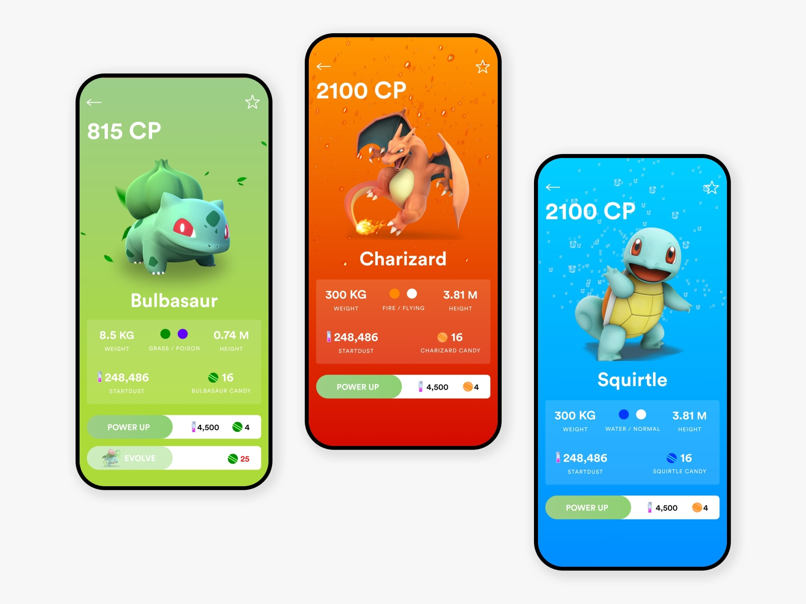

# Pokemon_v2
> Pokemon Quest: Gotta Catch 'Em All!
> Live demo [_here_](hhttps://pokemon-v2-agnieszka26.vercel.app/) 


## Table of Contents
* [General Info](#general-information)
* [Technologies Used](#technologies-used)
* [Features](#features)
* [Screenshots](#screenshots)
* [Setup](#setup)
* [Usage](#usage)
* [Contact](#contact)


## General Information
Welcome to Pokemon_v2, your ultimate destination for Pokemon battles, exploration, and fun! This exciting mobile app brings the beloved world of Pokemon to your fingertips, allowing you to embark on thrilling adventures, collect powerful Pokemon, and compete with other trainers from around the globe.


## Technologies Used
###### general: 
- typescript  - version ^5
- yarn - version ^1.22.17
- node - vesrion ^20.11.0
###### backend
- apollo-server - vesrsion ^4.10.0
- graphql - version ^16.8.1
###### frontend 
- next - version  14.1.0,
- react- version  ^18,
- rettier- version  ^3.2.5,
- tailwindcss - version  ^3.3.0,
- daisyui- version ^4.7.2,
- eslint- version  ^8,
- husky- version  ^9.0.11,
- postcss - version ^8,


## Features
1. **Registration & Login:** Get started on your Pokemon journey by creating your account and logging in to access all the amazing features of the app.

2. **Collect Your Pokemon:** Venture into the wild and capture a diverse array of Pokemon species to add to your collection. From classic favorites to rare finds, there's always a new Pokemon waiting to be discovered.

3. **Explore Available Pokemon:** Browse through a comprehensive list of Pokemon available in the game, complete with detailed descriptions and stats to help you choose your team wisely.

4. **Compare Your Pokemon:** Test the strength of your Pokemon by comparing them with those of other trainers. Analyze stats, movesets, and abilities to strategize your battles and become the ultimate Pokemon master.

5. **Compete and Win:** Enter thrilling battles against other trainers in real-time PvP matches. Use your skills, knowledge, and carefully crafted team to outsmart your opponents and claim victory.

6. **Gain Points and Rewards:** Earn points and rewards for your victories in battles, completing quests, and achieving milestones. Level up your trainer profile, unlock new features, and unlock exclusive rewards as you progress.


## Screenshots

<!-- If you have screenshots you'd like to share, include them here. -->


## Setup
### Getiing started
1. First clone code from repository in your dedicated folder
```bash
git clone https://github.com/Agnieszka26/pokemon_v2.git
```
2. When you have the project cloned move to client folder...:
```bash
cd pokemon_v2/client
```
3. ...where install nessesary dependencies:
```bash
yarn install
```
note: If you have not installed yarn globally you have to - the project requrires yarn.
4. Create yourown enviromental variables in .env file on the same level as app folder with keys: 
```
NEXT_PUBLIC_EXAMPLE_KEY_IN_ENV= 
```
5. Lastly, run the development server:

```bash
yarn dev
```
Open [http://localhost:3000](http://localhost:3000) with your browser to see the result.

**Congrats! 🚀 Your fronted is ready!**
Now, lets move to your backend server:

6. In your terminal run
```bash
cd ../server
```
7. install your dependencies via npm
```bash
npm install
```
8. make your local backend server up and running:
```
npm dev
```
**Congrats! 🚀 Your backend is ready!** 
Now the project is redy to development and testing on your lokal machine!
<!--@todo: When be and fr will be connected update this-->


## Usage
The purpouse of this project is to train the skills as a fullstack developer. The project is in development status. If you want to develop this project, do not hesitate and contact us!


## Project Status
Project is: _in progress_ 

## Contact
Created by [@UlEdy ](https://github.com/UlEdy) and [@Agnieszka26](https://github.com/Agnieszka26) - feel free to contact us!


<!-- Optional -->
<!-- ## License -->
<!-- This project is open source and available under the [... License](). -->

<!-- You don't have to include all sections - just the one's relevant to your project -->